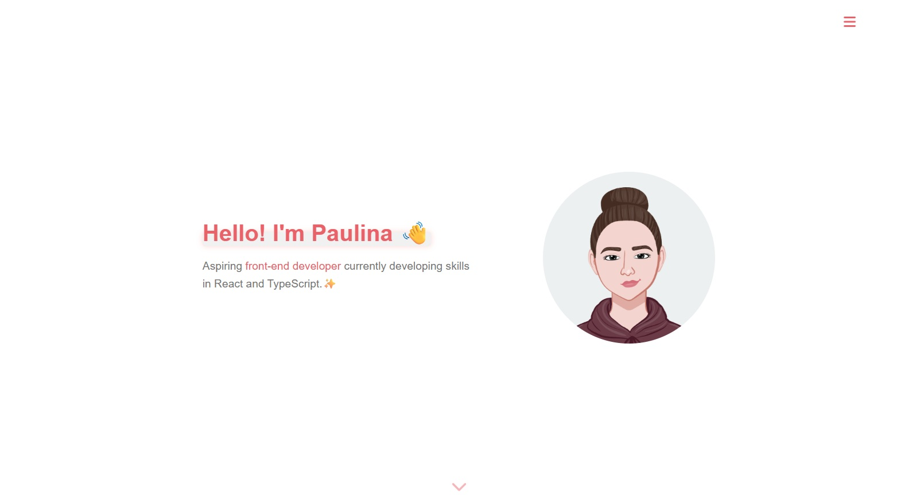

# ✨ Portfolio – React + TypeScript

Minimalist - about me page, where I can show you what I am currently working on.
To create this, I was using React, Typescript and css.
---

- There's hello section
- Cv
- some of my apps
- about me
---

# ✨ Functions
- interactive buttons
- go to live app - button
---

## 🌐 Live Demo

Click the image to see portfolio:  

[](https://paulinakuberska.vercel.app/)

---

## ✨ Project strukture

```
src/
├─ components/
│  ├─ ScrollSection.tsx
│  ├─ Section.tsx
├─ scss/
│  ├─ components
│     ├─ Projects.scss
│     ├─ ProjectsContainer.scss
│     ├─ Section.scss
│     ├─ SectionContainer.scss
│  ├─ variables
│     ├─ colors.scss
│     ├─ fonts.scss
│     ├─ text.scss
├─ General.scss
├─ App.tsx
├─ doc.ts
```
